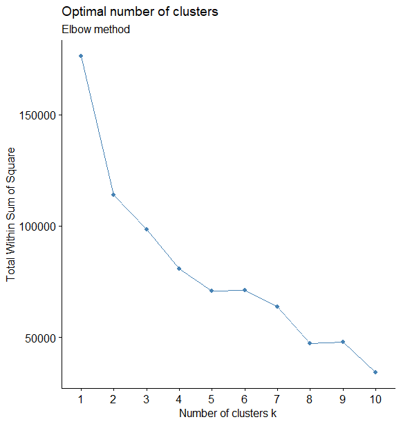
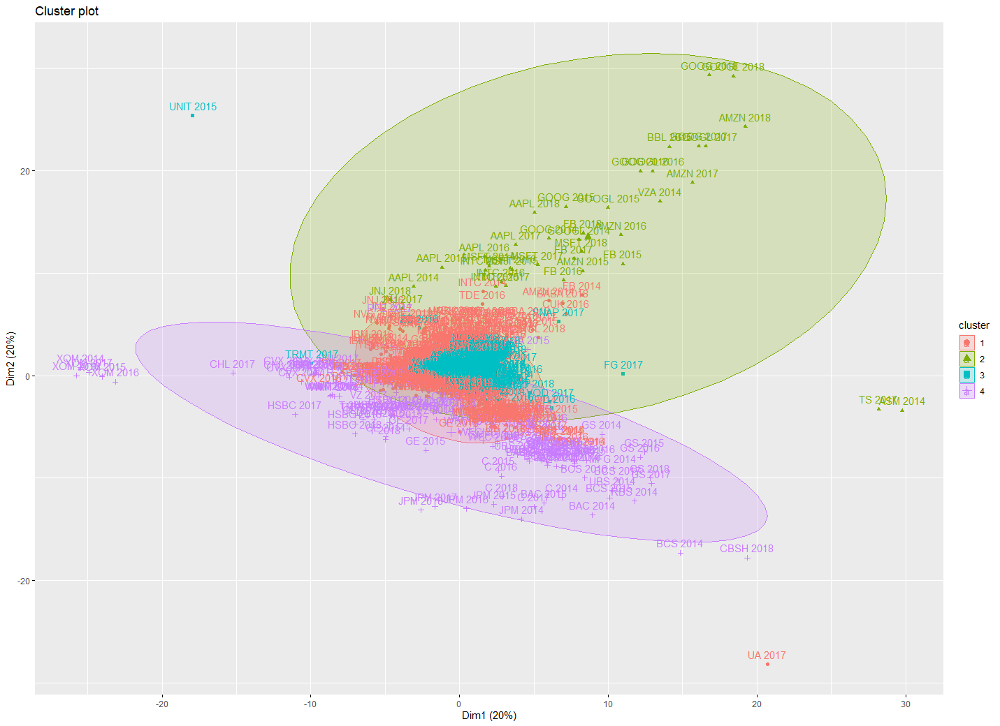

# Introduction

## Background

  The stock market is a marketplace where investors can purchase or sell shares of publicly traded companies. As of 2019, the amount of money invested in the global stock market has surpassed over $85 trillion. Since the inception of the stock market, investors have continuously sought to develop methods of improving their returns. Currently, there are two main schools of thought when it comes to stock market analysis: technical analysis and fundamental analysis.

*Technical analysis* looks at buying and selling trends of a particular stock. The core theory of technical analysis assumes that all information is already factored into the stock price. As such, technical analysis prioritizes identifying patterns or trends in time-series data to predict stock price at a particular time point.

*Fundamental analysis* attempts to measure the intrinsic value of a company by studying information from that company’s balance sheet, such as revenue or debt. Fundamental analysis attempts to identify companies that appear to be ‘undervalued’ or ‘overvalued’ to inform buy or sell recommendations.

Previous machine learning models that simulated stock market returns have largely focused on using time series data to predict stock trends, which is more akin to technical analysis. However, such models have run into challenges such as overfitting or a lack of interpretability. One benefit of fundamental analysis is that it allows the investor to learn about which aspects of a company’s financials will influence that company’s stock price; it is more interpretable. As there are dozens to hundreds of variables on a company’s balance sheet, the use of machine-learning approaches may augment fundamental analysis by pinpointing important markers of a company’s financials and their relationship with the stock price.

## Objective

In this project, we apply machine learning and data science techniques to predict the market capitalization, which is how much company is worth on the stock market. Stock price can then be calculated by dividing market capitalization by total number of stocks issued. We also create an application using R shiny to be used as a guide for investors. This application would be used individuals interested in checking their stock analyses with a machine learning prediction. The application could be used by financial analysts, portfolio managers, or non-professional investors with an interest in fundamental analysis.

# Methodology

```{r libraries, message = FALSE, warning = FALSE, echo = FALSE}

library(knitr)
library(dplyr)
library(readr)
library(finalfit)
library(cluster)
library(factoextra)
library(dendextend)
library(ggplot2)
library(FactoMineR)
library(NbClust)
library(Hmisc)
library(ggcorrplot)
library(tidyverse)
library(car)
library(caret)
library(VIF)
library(mice)
library(rpart)
library(factoextra)
library(gbm)
library(xgboost)
library(grid)
library(gridExtra)
library(heatmaply)
library(xtable)
```

## Data Preprocessing
The original dataset was obtained from Kaggle. Five datasets were combined together containing stock information for different years: 2014, 2015, 2016, 2017 and 2018, respectively. There were 225 columns in the original dataset. However, after curating the data, only 66 columns were chosen as fundamental columns and were included in the project. 

## Missingness
The dataset was assessed for missing values. Any columns that had more then 1/3 of the data as missing values were removed. For the rest of the columns, data imputation was performed using the MICE package in R. We used the CART method to impute the data. CART imputes values by using classification and regression trees. Four columns were left with missing values after imputation. Those columns were removed leaving a dataset with a total of 62 columns. 


## Feature Selection
It is important to note that this project contains both unsupervised and supervised learning. Decision Tree was used for feature selection. Decision tree is a classification algorithm used for classification problems, as well as detecting variable importance in a dataset. The top 10 important variables from the decision tree were selected as the features. They were used to run k-means unsupervised learning, which determined 4 clusters of data. Then, supervised learning dataset was selected as the top 10 variables selected from the decision tree plus the cluster # (as a categorical variable) and the Sector of the stock. Thus, the unsupervised learning data contained 10 features, while the supervised learning data contained 12. 

```{r predictor table, echo=FALSE, message=FALSE}
predictors_list <- list('Consolidated.Income', 'Dividend.payments','Stock.based.compensation','Income.Tax.Expense','Retained.earnings deficit','Operating.Cash.Flow','Operating.Expenses','R.D.Expenses','Total.debt','Long.term.debt')
predictors_type <- list('numeric', 'numeric', 'numeric', 'numeric', 'numeric', 'numeric','numeric','numeric','numeric','numeric')
predictors_df <- data.frame(matrix(unlist(predictors_list), nrow=10, byrow=TRUE), stringsAsFactors = FALSE)
predictors_df <- predictors_df %>% mutate(blank = c(" "," "," "," "," "," "," "," "," "," "),Description = predictors_type)
colnames(predictors_df) <- c("Variable", "             ", "Type")
kable(predictors_df, format='pipe', caption = 'Common Predictor variables')
```

## Principal Component Analysis
We applied Principal Component Analysis (PCA) to our feature dataset for dimension reduction before doing unsupervised learning using the k-Means clustering algorithm. PCA creates orthogonal 'principal components' of the feature set, reducing multicollinearity within the data. Although the k-means algorithm is non-parametric, the reduction in multicollinearity by PCA could lead to greater discrimination between the observations.

## Unsupervised Learning
The k-Means algorithm was performed in order to cluster the data before supervised learning. The number of clusters was evaluated by plotting the within-cluster sum of squares (WSS) against the number of clusters (k). The optimal number of clusters was chosen based on a combination of the 'elbow method' and domain knowledge.  

## Supervised Learning
Supervised learning was performed using four algorithms: XGBoost, Random Forest, Lasso Model and GBM Model. XGBoost is a very powerful algorithm which drives fast learning and offers efficient usage of storage. XGBoost uses ensemble learning, which is a systematic solution that combines the predictive power of multiple learners. It outputs a single model that gives the combined output from many models. This allows the opportunity to not rely on the results of a single machine learning model.In this particular model, the trees are built sequentially, such that the next tree focuses on reducing  the errors of the previous tree. Random forest is another supervised learning model that uses "ensemble" method to fit many decision trees by using a subset of the rows and then taking the "mode" of the predicted class. GBM, which stands for Gradient Boosting Machine, is also a gradient boosting algorithm that works similar to XGBoost. However, XGBoost has more tuning parameters, thus both algorithms were chosen for comparison. All models were ran and they were evaluated using the k-fold cross validation method. Three accuracy metrics: Root Mean-Squared Error (RMSE), Pearson correlation ($R^2$), and Mean Average Error (MAE) were used to chose the final model.

## Deployment
Due to its accuracy, size, and speed in predicting, we chose the XGBoost model to include in our application. The application's main function is to provide a recommendation for a stock based on the financial information released by the company. The application is built to be used by financial advisers and portfolio managers. The main page allows the user to input a ticker ID. If the ID is in the database, the application will pull the latest financial data for the company, and run the model on that data. The application then compares the predicted market cap with the current market cap and provides a recommendation based on the difference. If the ID is not in the database, the user can manually enter the financial data for the company in order to produce a recommendation. The application uses data provided by the API from [https://financialmodelingprep.com/](https://financialmodelingprep.com/). The application is limited by the availability of the financial data and the restrictions provided by the free account on financialmodelingprep.com. For a full deployment, a paid account would be needed.

The application can be found here [https://colin-green.shinyapps.io/stock-evaluator/](https://colin-green.shinyapps.io/stock-evaluator/)

# Results

```{r create a table describing the columns and rows, echo=FALSE, message=FALSE}
data_description <- c('Index of the records', 'Stock ticker symbol', 'Describe all changes in equity except investments made by owners in a period of time', 'A dividend payment to shareholders','Describe the rewords to employees in lieu of cash made by stock or stock options', 'Total amount of tax', 'Represent the negative or debt banlance', 'Measuremnent of the amount of cash the company generated', 'The amount of expense of a company', 'Research and development of tax return', 'Sum of long term debt and short term debt', 'Value of long term debt','market capitalization for a company')
data <- c("X.1", "X", 'Consolidated.Income', 'Dividend.payments','Stock.based.compensation','Income.Tax.Expense','Retained.earnings deficit','Operating.Cash.Flow','Operating.Expenses','R.D.Expenses','Total.debt','Long.term.debt','Market.Cap')
datadictionary <- data.frame(matrix(unlist(data), nrow=13, byrow=TRUE), stringsAsFactors = FALSE)
datadictionary <- datadictionary %>% mutate(blank = c(" "," "," "," "," "," "," "," "," "," "," "," "," "),Description = data_description)
colnames(datadictionary) <- c("Variable", "             ", "Type")
kable(datadictionary, format='pipe', caption = 'Data Dictionary')
```

## Data Preparation

```{r data preparation,  echo=FALSE, message=FALSE}
#load in the first file
data_2014 <- read.csv('2014_Financial_Data.csv')
data_2015 <- read.csv('2015_Financial_Data.csv')
data_2016 <- read.csv('2016_Financial_Data.csv')
data_2017 <- read.csv('2017_Financial_Data.csv')
data_2018 <- read.csv('2018_Financial_Data.csv')

#add a column for year
data_2014 <- data_2014 %>% mutate(year=2014)
data_2015 <- data_2015 %>% mutate(year=2015)
data_2016 <- data_2016 %>% mutate(year=2016)
data_2017 <- data_2017 %>% mutate(year=2017)
data_2018 <- data_2018 %>% mutate(year=2018)

#fix the column name
colnames(data_2014)[224] <- 'PRICE.VARR'
colnames(data_2015)[224] <- 'PRICE.VARR'
colnames(data_2016)[224] <- 'PRICE.VARR'
colnames(data_2017)[224] <- 'PRICE.VARR'
colnames(data_2018)[224] <- 'PRICE.VARR'

complete_data <- rbind(data_2014, data_2015, data_2016, data_2017, data_2018)

#only include fundamental columns
complete_data <- subset(complete_data[,c(1:4,6:8,10,12:14,16,20,22,30,33,34,36,38,40:43,45:53,55,56,60:74,142,176,179:190,223,226)])
complete_data <- complete_data[complete_data$X != 'IGLD', ]
complete_data <- complete_data[complete_data$X != 'SBT', ]
complete_data <- complete_data[complete_data$X != 'KST', ]
complete_data <- complete_data[complete_data$X != 'AMX', ]

```

## Missing Values
After we finished the first step of data cleaning, we want to do the data validation. For missing values, as the plot shown, a lot of observations make up the majority of the missing data and we decided to remove observations that have more than a third of the columns NA. After we removed those observations, we set the sector and year columns as a factor and saved the new data set into a new CSV files for further data exploration.

```{r missing values, echo=FALSE, message=FALSE, fig.cap='Missing values map before imputation', fig.align='center'}
missing_plot(complete_data)
#sort((sapply(complete_data, function(x) sum(is.na(x)))), decreasing=TRUE)

complete_data_remove<-complete_data[which(rowMeans(!is.na(complete_data))>(1/3)),]
#missing_plot(complete_data_remove)
#sort((sapply(complete_data_remove, function(x) sum(is.na(x)))), decreasing=TRUE)

complete_data_remove$Sector <- as.factor(complete_data_remove$Sector)
complete_data_remove$year <- as.factor(complete_data_remove$year)

#save the new data set as a csv
#write.csv(complete_data_remove,"fundamental_data.csv")
pvq <- quantile(complete_data_remove$Market.Cap, probs = c(0.01,0.99), names=FALSE, na.rm=TRUE)
plot_data <- complete_data_remove
plot_data[plot_data==0] <- NA

```


To account for missing values, we chose to use the CART (Classification and Regression Trees) method of imputation. After imputation, 4 columns still have missing values, which were then subsequently removed. 

```{r CART imputation, echo=FALSE}
# cart <- readRDS('cart_imputation.rds')
# complete_cart <- complete(cart, 1)
# complete_cart <- subset(complete_cart[,c(1:22,24:28,31,33:65)])
# complete_cart$year <- as.factor(complete_cart$year)
# densityplot(cart)
# write.csv(complete_cart, 'full_set.csv')
# summary(complete_cart)
```


## Correlation Plot
There were 62 columns after we finished data cleaning, and we want to select the important features to do modeling.
We performed a correlation analysis based on Pearson's coefficient between each numeric predictor first. We considered a |correlation| > 0.8, with p < 0.05 as a significant correlation. \hyperref[sec:fig3]{Figure 3} demonstrates significant correlation between many of our predictor variables. 
However, due to the large amount of variables, the correlation plot was uninterpretable if we try to plot all the variables, therefore, we tried to filtered the correlation plot, keeping only variables that had a correlation with absolute value greater than 0.8.

```{r corrplot, echo=FALSE,fig.height=5, fig.width=5,fig.align='center', fig.cap='Correlogram of variables with |R| > 0.8'}
#corrplot for numerical
df_full <- read.csv('full_set.csv')
df_full_numeric <- subset(df_full, select =c(3:60))
cor <- rcorr(as.matrix(df_full_numeric))
p.mat <- cor_pmat(as.matrix(df_full_numeric))

#invisible(ggcorrplot(cor$r, type = 'upper', p.mat = p.mat, sig.level = 0.05, lab = TRUE, lab_size = 0.1))
cor_mat <- cor$r
cor_mat[!lower.tri(cor_mat)] <- NA # remove diagonal and redundant values

# cor2 <- data.frame( cor_mat) %>%
#   rownames_to_column() %>%
#   gather(key="variable", value="correlation", -rowname) %>%
#   filter(abs(correlation) > 0.8 & abs(correlation) < 1)

corrtable <- as.data.frame(as.table(cor_mat))
corrtable <- na.omit(corrtable) 
corrtable <- corrtable[corrtable$Freq > abs(0.8), ]
mtx_corrtable <- spread(corrtable, Var1, Freq)
mtx_corrtable[is.na(mtx_corrtable)] <- 0
rownames(mtx_corrtable) <- mtx_corrtable$Var2
mtx_corrtable$Var2 <- NULL
ggcorrplot(mtx_corrtable, type = 'upper', lab = TRUE)

```

## Data Distribution
we then performed the distribution plot for all the columns to check the data distribution, to observe the means, and check for outliers. Most variables were not normally distributed and had a clear skew. In Figure 3, we show a subset of the variable distributions.

```{r data normal distribution, echo = FALSE, message = FALSE, warning = FALSE}
df_normalize <- normalize(df_full)
plot_index <- list()
for (i in c(3:62)){
  
  plot_index[[names(df_full[i])]] <- ggplot(df_normalize, aes(x = df_normalize[[i]])) +
    stat_function(
      fun = dnorm,
      args = with(df_normalize, c(mean = mean(df_normalize[[i]], na.rm=TRUE), 
                            sd = sd(df_normalize[[i]], na.rm=TRUE))))+
    labs(title=as.list(names(df_normalize[i])), x='',y='Price Change')
  #ggsave(paste(as.list(names(df[i])),'plot.png',sep=''))
  #print(plot_index[[names(df_full[i])]])
  
}

nCol <- 3
```

```{r data normal distribution plot1, echo = FALSE, message = FALSE, warning = FALSE,fig.height=5, fig.width=5,fig.align='center', fig.cap='Column distributions'}
 plot1 <- do.call("grid.arrange", c(plot_index[1:9], ncol=nCol))
```

<!-- ```{r data normal distribution plot2, echo = FALSE, message = FALSE, warning = FALSE, fig.height=5, fig.width=5,fig.align='center' } -->
<!-- plot2 <- do.call("grid.arrange", c(plot_index[10:20], ncol=nCol)) -->
<!-- ``` -->

<!-- ```{r data normal distribution plot3, echo = FALSE, message = FALSE, warning = FALSE,fig.height=5, fig.width=5,fig.align='center' } -->
<!-- plot3 <- do.call("grid.arrange", c(plot_index[20:30], ncol=nCol)) -->
<!-- ``` -->

<!-- ```{r data normal distribution plot4, echo = FALSE, message = FALSE, warning = FALSE,fig.height=5, fig.width=5,fig.align='center' } -->
<!-- plot4 <- do.call("grid.arrange", c(plot_index[30:40], ncol=nCol)) -->
<!-- ``` -->

<!-- ```{r data normal distribution plot5, echo = FALSE, message = FALSE, warning = FALSE,fig.height=5, fig.width=5,fig.align='center' } -->
<!-- plot5 <- do.call("grid.arrange", c(plot_index[40:50], ncol=nCol)) -->
<!-- ``` -->

<!-- ```{r data normal distribution plot6, echo = FALSE, message = FALSE, warning = FALSE,fig.height=5, fig.width=5,fig.align='center' } -->
<!-- plot6 <- do.call("grid.arrange", c(plot_index[50:58], ncol=nCol)) -->
<!-- ``` -->

## Feature Selection

In order to do our feature selection, we ran a decision tree model to determine important variables within our dataset. Below are plots showing the importance of each variable as well as their correlations with one another.
```{r variable importance,fig.height=5, fig.width=5,fig.align='center', fig.cap='Top 10 variable importance, determined by Decision Tree', echo=FALSE}
tree_imp2 <- read.csv('tree_imp2.csv')
par(mar=c(5,9,4,1)+.1)
barplot(tree_imp2$tree_mod.finalModel.variable.importance[10:1], horiz = TRUE, las = 1, names.arg = tree_imp2$X[10:1], col = 4, cex.names = 0.8, cex.axis = 0.8, main = 'List of Variables by Importance')
```
```{r text summary, include=FALSE}
df_full <- subset(df_full[,c(2,16,43,35,10,31,36,8,6,28,27,47)])
write.csv(df_full,'important.csv')
```
```{r corrplot 2, echo=FALSE,fig.height=5, fig.width=5,fig.align='center', fig.cap='Correlation of Top 10 Variables' }
#corrplot for numerical
df <- read.csv('important.csv')
df_numeric <- subset(df, select =c(3:13))
cor <- rcorr(as.matrix(df_numeric))
p.mat <- cor_pmat(as.matrix(df_numeric))
par(mfrow=c(1,1))

```

``````{r correlation plot 2, echo=FALSE,fig.align='center', fig.cap='Correlogram of Top 10 Variables'}
ggcorrplot(cor$r, type = 'upper', p.mat = p.mat, sig.level = 0.05, lab = TRUE, lab_size = 2)

```


## Principal Component Analysis
We performed PCA to reduce the dimensionality of our feature dataset. The Scree plot shows the overall variance explained by each principal component. The top 5 dimensions explained approximately 90% of the total variance within the data. Individual datapoints involving large technology companies (Google, Apple, Amazon) had high contributions to the overall variance. R&D Expenses and Stock-based compensation were two variables with high contribution to variance, while Income Tax Expense and Operating Cash Flow had more negligible contribution.  

```{r scree, message = FALSE, warning = FALSE, echo = FALSE, fig.cap= 'Scree plot', fig.height=3, fig.width=3,fig.align='center'}
df_PCA <- read.csv('important.csv')
df_imputed <- read.csv('full_set.csv')
df_PCA$year <- df_imputed$year
df_PCA$uniqueticker <- paste(df_PCA$X, df_PCA$year)
rownames(df_PCA) <- df_PCA$uniqueticker
df_PCA <- df_PCA[, !names(df_PCA) %in% c('X','X.1', 'Market.Cap', 'year','uniqueticker','Sector')]
res.pca <- PCA(df_PCA, graph = FALSE)
fviz_eig(res.pca)
```
```{r PCAind, message = FALSE, warning = FALSE, echo = FALSE, fig.cap= 'Effect of Individual points - PCA',fig.height=4,fig.width=4,fig.align='center'}
#color visualization for individual companies
fviz_pca_ind(res.pca,
             col.ind = "cos2", # Color by the quality of representation
             gradient.cols = c("#00AFBB", "#E7B800", "#FC4E07")
)
```
```{r PCAvar, message = FALSE, warning = FALSE, echo = FALSE, fig.cap= 'Effect of Variables - PCA',fig.height=4,fig.width=4,fig.align='center'}
#color visualization for variables
fviz_pca_var(res.pca,
             col.var = "contrib", # Color by contributions to the PC
             gradient.cols = c("#00AFBB", "#E7B800", "#FC4E07"),
             repel = TRUE     # Avoid text overlapping
             )
```
## K Means Clustering
The 'elbow method' was first performed to determine an optimal number of k clusters. However, there was no significant drop in within-cluster sum of squares with k besides k=2. As two clusters did not provide much discrimination for our observations, we instead used k=4 as the final number of clusters. 
```{r elbow,fig.cap='Elbow method', out.height='40%', out.width = '60%', message = FALSE, warning = FALSE, echo = FALSE, fig.height = 3,fig.width=3,fig.align='center'}

```
The following figure displays our datapoints in a 2-D space based on 4 clusters.
\begin{landscape}
```{r cluster,fig.cap='K means clustering, k = 4', message = FALSE, warning = FALSE, echo = FALSE, out.height='100%', out.width='100%'}

```
\end{landscape}

## Cluster Interpretation
We performed some exploratory visualizations to interpret how the data was clustered by k-means. Cluster 1 contained the majority of observations, with n=19759. Cluster 2 had 35 observations, cluster 3 had 126, and cluster 4 had 586. On average, cluster 1 contained more small- and medium-sized companies compared to other clusters, with 89% of observations falling under a market cap of $10 billion.  
```{r cluster by marketcap, echo = FALSE, message = FALSE, fig.cap = 'Clusters by Market Cap', fig.align='center', fig.height=5,fig.width=5}
df_updated <- read.csv('important_with_clusters_updated.csv')
nasdaq <- read.csv('nasdaq.csv')
nasdaq$Ticker <- toupper(nasdaq$Ticker)
names(nasdaq) <- c('X','name')
NYSE <- read.delim("NYSE.txt")
NYSE <- data.frame(NYSE)
names(NYSE) <- c('X','name')
stocks_lookup_table <- rbind(NYSE,nasdaq)
df_updated$cluster <- as.factor(df_updated$cluster)
rownames(df_updated) <- df_updated$X.2
df_updated <- df_updated[df_updated$X.1!=373,]
df_updated <- df_updated[df_updated$X.1!=4027,]
df_updated <- df_updated[df_updated$X.1!=12158,]
df_updated <- df_updated[df_updated$Market.Cap!= 0,]
df_updated$PPR <- (df_updated$R.D.Expenses/df_updated$Market.Cap)
df_updated$DPR <- abs(df_updated$Dividend.payments/df_updated$Market.Cap)
df_updated$DTI <- df_updated$Total.debt/df_updated$Consolidated.Income
df_updated$`P/E` <- df_updated$Market.Cap/df_updated$Retained.earnings..deficit.
df_c1 <- subset(df_updated, df_updated$cluster==1) #everything else
df_c2 <- subset(df_updated, df_updated$cluster==2) #Big tech, 'FANG'
df_c3 <- subset(df_updated, df_updated$cluster==3) #big banks + oil
df_c4 <- subset(df_updated, df_updated$cluster==4) #big pharma, consumer goods?
ggplot(df_updated, aes(x = log(Market.Cap), color=cluster)) + geom_density() + labs(title = 'Clusters by Market Cap')
```
K-means was able to segregate the large high-tech companies: Facebook, Apple, Amazon, Google, Intel, and Microsoft all into one cluster (Cluster 2). We noted that these companies trended towards  large market capitalization, high stock compensation, and high R & D expenses. Cluster 3 contained a significant majority of big banks, such as JP Morgan, Wells Fargo, and Bank of America, as well as large energy corporations such as ExxonMobil and Chevron. Clusters 1 and 4 had similar sector distributions, although companies in cluster 4 were all large cap. Interesting to note that the top 20 big pharmaceutical and healthcare companies were mainly in cluster 4, such as Johnson & Johnson, Roche, and Abbvie.   
```{r sector, echo = FALSE, message = FALSE, fig.cap = 'Clusters by Sector', fig.align='center', fig.height=5,fig.width=5}
ggplot(df_updated, aes(x=cluster, fill = Sector)) + geom_bar(position = 'fill')
```
Price-to-earnings ratio is a common method of determining how a company is valued by investors. A high P/E ratio may suggest that investors are willing to pay a higher price for that company's share price because of future growth expectations. Here, we see that cluster 2, composed largely of high-tech companies such as Google, had high P/E ratios - aligning with investor sentiments about the growth of the industry. Cluster 1 maintains an interesting bimodal distribution of positive and negative P/E ratios. Stocks with negative P/E ratio suggest that these companies are reporting a loss. 

```{r pe ratio,  echo = FALSE, message = FALSE, fig.cap = 'Clusters by P/E ratio', fig.align='center', fig.height=5,fig.width=5}
ggplot(df_updated[df_updated$`P/E` > -10 & df_updated$`P/E` < 50,], aes(x = `P/E`, color=cluster)) + geom_density() + labs(title = 'Clusters by P/E ratio')
```
Normalizing for the proportion of small-medium and large cap stocks in cluster 1, we noted that small to medium-sized companies were 2 to 3 times more likely to have a negative P/E ratio compared to large companies. The bimodal distribution in cluster 1 can therefore be partially explained by a split between the distribution of company size.
```{r pe ratio clust1,  echo = FALSE, message = FALSE, fig.cap = 'Cluster 1: Market Cap vs. P/E Ratio', fig.align='center', fig.height=5,fig.width=5}
ggplot(df_updated[df_updated$cluster==1 & df_updated$`P/E` > -10 & df_updated$`P/E` < 50,], aes(x = `P/E`, y=Market.Cap,color=Sector)) + geom_point() + labs(title = 'Cluster 1: Market Cap vs. P/E Ratio')
```
## Modeling
The k-fold cross-validation method evaluates the model performance on different subsets of the training data calculates the average prediction error rate. We used k = 10 for our project,and this method was used instead of the simple train-test-split as it gives a more valid estimation of model effectiveness.

## XGBoost
    The XGBoost model was ran and was parametrized using grid method.The final parameter values used by the best model were nrounds = 200, max_depth = 6, eta = 0.1, gamma = 0, colsample_bytree = 0.5, min_child_weight = 1 and subsample = 0.8.
```{r XGBoost, message = FALSE, warning = FALSE, echo = FALSE,fig.height=5, fig.width=5,fig.align='center', fig.cap='XGBoost Tuning Parameters', results='hide', fig.keep='all'}
invisible(XGB_model_albina_updated <- readRDS("XGB_model_albina_updated.rds"))
ggplot2::ggplot(varImp(XGB_model_albina_updated))
plot(XGB_model_albina_updated)
```

## Gradient Boosting
The gradient boosting model was tuned by several different parameters. The final values used for the model were n.trees = 600, interaction.depth = 9, shrinkage = 0.1 and n.minobsinnode = 20
```{r gradient boosting, message = FALSE, warning = FALSE, echo = FALSE ,fig.height=5, fig.width=5,fig.align='center'}
Gradient_Boosting_model <- readRDS("GBM_Model.rds")
ggplot2::ggplot(varImp(Gradient_Boosting_model))

```
##Random Forest

## Model Selection
All models found $Consolidated Income$ and $Stock based Compensation$ and $Dividend Payments$ to be important predictors of Market.Cap. Mean Absolute Error (MAE) tells the average error of the variable we want to predict. Root Mean-Squared Error (RMSE) is similar with MAE but it is more useful when we are interested in fewer larger errors over many small errors. Overall, we prioritize model stability and thus prioritized RMSE over MAE. $R^2$ computes how much better the regression fits the data than the mean line, which gives an overall score.For predicting market cap, we desired a model with the lowest RMSE and MAE to keep the high accuracy of prediction. The XGBoost model had the highest $R^2$ as well as the lowest RMSE and MAE, thus, it was chosen for deployment.

```{r create dataframe of model performance, echo=FALSE}
models <- c("random_forest","extreme_gradient_boosting","gradient_boosting" )
model_performance <- data.frame(matrix(unlist(models), nrow=3, byrow=TRUE), stringsAsFactors = FALSE)
colnames(model_performance) <- c("model")
RMSE<- c(274957.8,10811777965,11765977743)
R2 <- c(0.8067,0.9010295,0.8754267)
MAE <- c(135701,2699512435,2917376718)
model_performance <- model_performance %>% mutate(RMSE = formatC(RMSE, format = "e", digits = 2), R2=round(R2,2), MAE=formatC(MAE, format = "e", digits = 2))
kable(model_performance, format = 'pipe', caption = 'Model Accuracy')
```


# Discussion


# Discussion